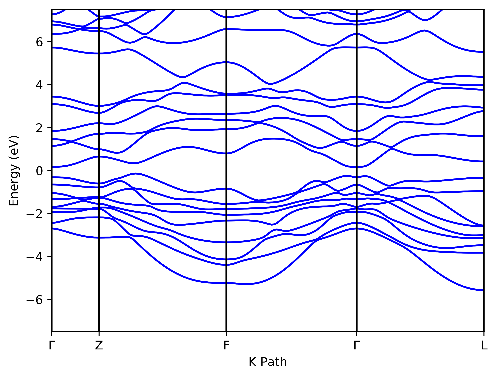
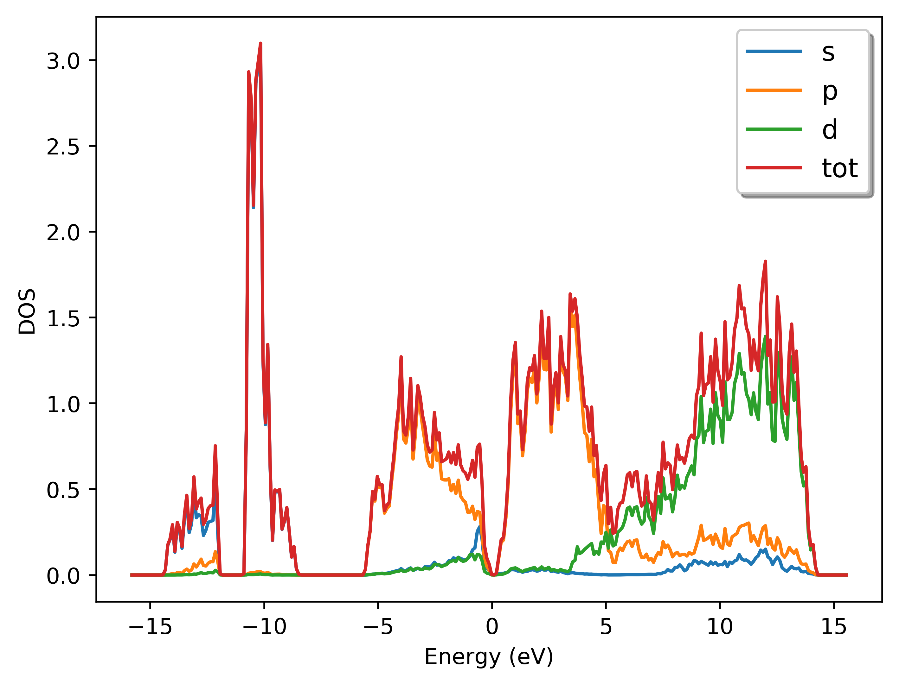
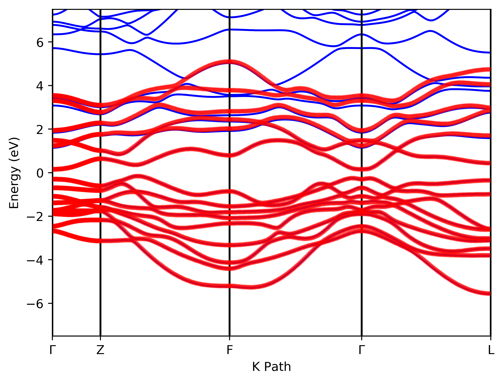
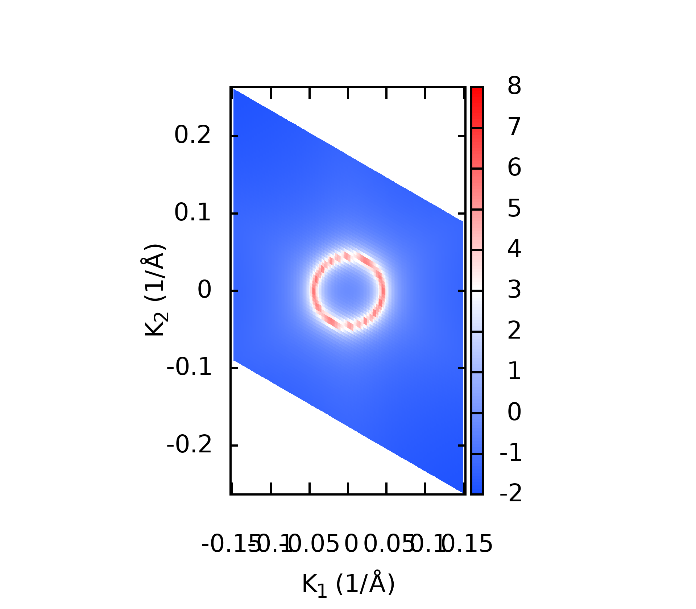
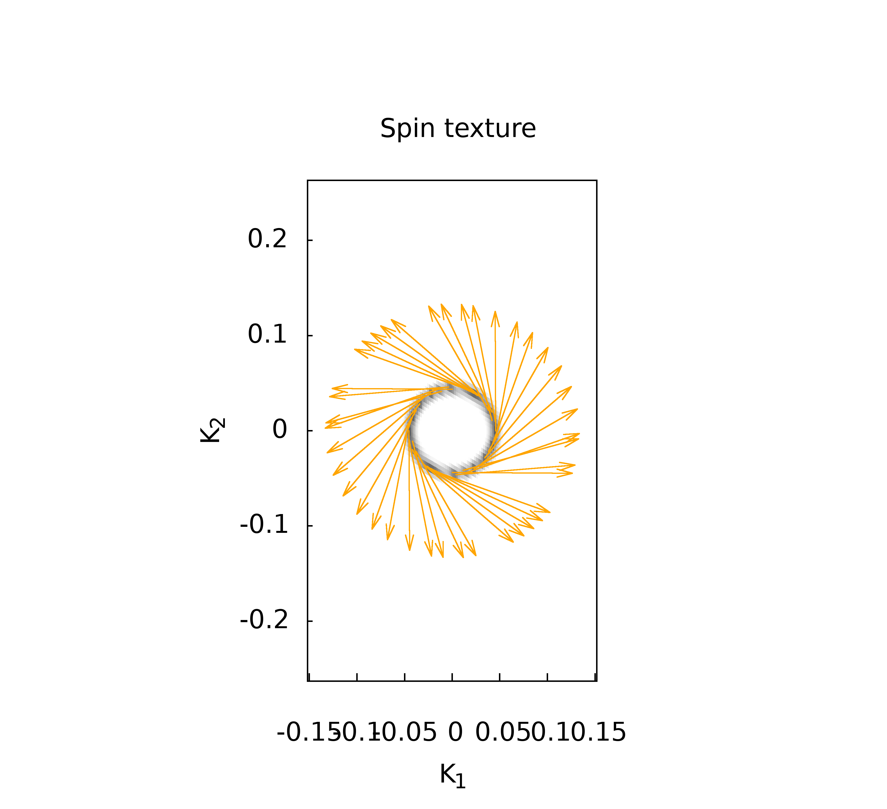
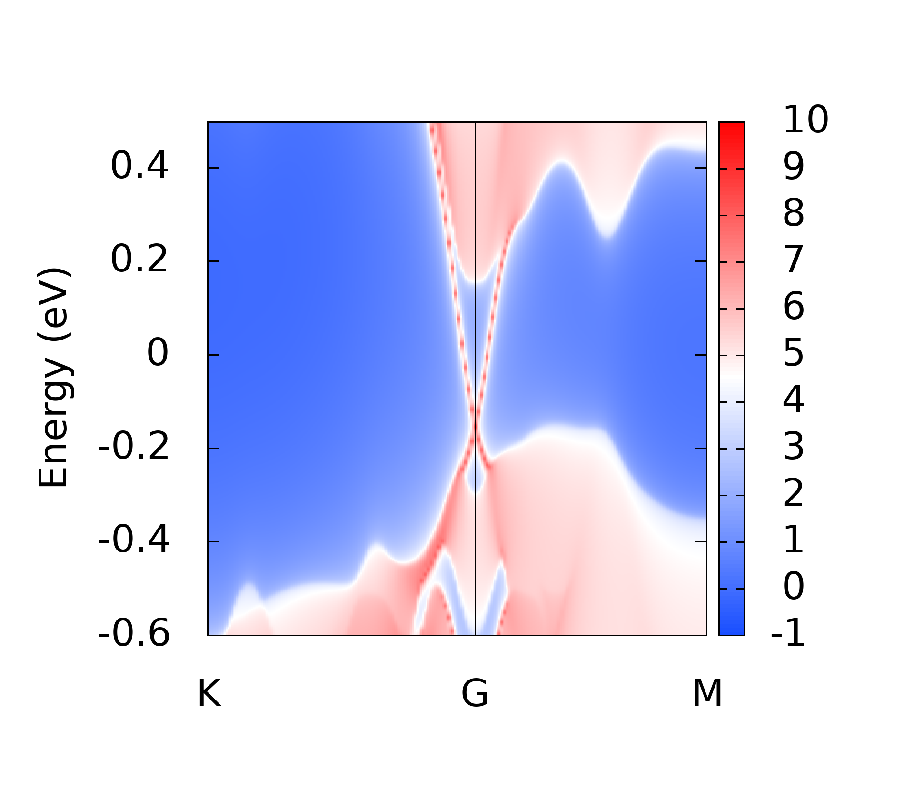
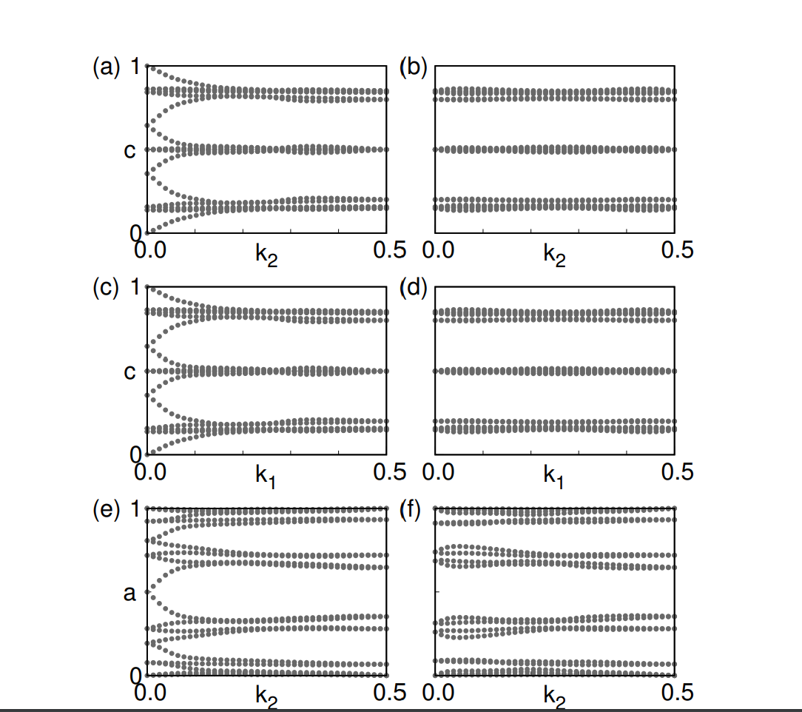

# MTRL 279: Surface State of Bi$_2$Se$_3$
- Wangqian Miao
- Materials Dept, UCSB
- 11/26/2021

---

## Band Structure from DFT

- SOC Calculation.
- PBE Functional (Band Gap problem at $\Gamma$ point, HSE?)
- Consistent well with Nature Physics **5**, 438–442 (2009)
- Conclusion: Bi$_2$Se$_3$ is a **Bulk Insulator**.

```bash
ISPIN  = 2
#NBANDS = 30 #Non SOC
NBANDS = 60  #If add SOC

LSORBIT = .TRUE.
LMAXMIX = 4
ICHARG  = 11
ISYM    = -1 
```



---


## Effective Tight Binding Hamiltonian

*Physicists prefer a concrete Hamiltonian!*

Construct Low energy TB model:
- Analyze the band component near Fermi level.
- For Bi$_2$Se$_3$, the contribution near
Fermi level mainly from $p$ orbitals.
- ⚠️Help determine projection orbitals in Wannier90.




---
- ⚠️Use Wannier90 to construct Maximum Localized Wannier Functions.
  - `num_bands` should be same as `NBANDS` in Vasp.
  - Most Tricky parameters, `dis_win_min`,  `dis_win_max`,  `dis_froz_min`, `dis_froz_max` .
  - check spread of wannier functions through output of Wannier90. (should be localized)
- ⚠️Check consistency between DFT and TB by plotting Bands.

Blue Lines from DFT. Red Dots from TB.




---

## Fermi Arc, Spin Texture, Surface State

Fortunately, *WannierTools* can help !😀



---

We see Dirac Cone in surface DOS! (More analysis should be conducted through $k \cdot p$ theory.)



---
## Topological Indices
*Symmetry plays an important role!*

$Z_2$ Topological Invariants:

- Theory: *Fu, Kane, Phys. Rev. B **76**, 045302*
- Numerics: *Yu, Dai and etc, Phys. Rev. B **84**, 075119*
- Conclusion: Bi$_2$Se$_3$ is a **Strong 3D TI**.



---

## How to study a normal TI?


For Computational Material Scientists:
1. DFT calculation to determine low energy state. (Most of them need SOC). 
2. ⚠️Analyze the band components near Fermi level.
3. ⚠️*Most Tricky*: Construct low energy TB by wannier90 through MLWF algorithm. 
4. ⚠️Check the consistency between DFT and TB.
5. Study topological properties of the TB Hamiltonian.
6. 🎈Predict experiments results. such as Surface state, Fermi Arc, Spin texture...

For Physicists, several more steps,
1. Symmetry Analysis, construct low energy $k \cdot p$ model.
2. Topological classification.

