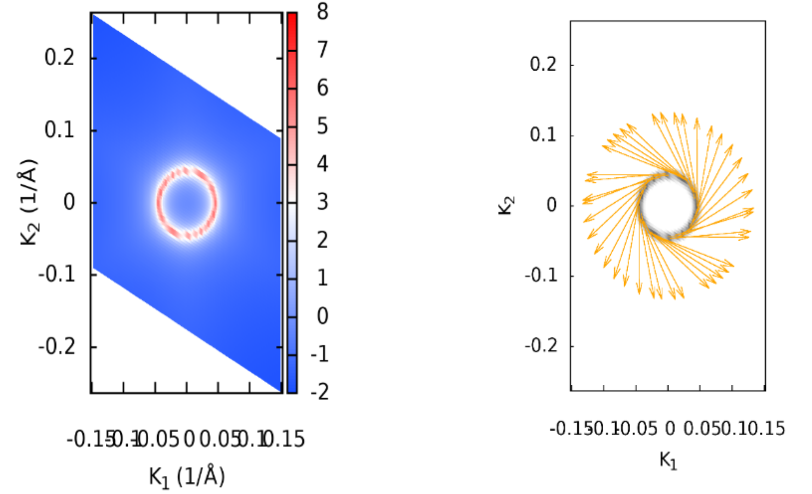

# MTRL 279: First Principle Study of Bi$_2$Se$_3$ and its Surface State
- Wangqian Miao
- Materials Dept, UCSB
- 12/2021


---
## Background of Bi$_2$Se$_3$

- Most *robust* 3D TI ever found. Discovered by theory and computation, confirmed later by experiments.
- A `Hello World` example for the computational study of *real* TI.
- SOC plays an important role, non magnetical material. Space Group $D_{3d}^5$.

```bash
Bi2Se3
1.0
-2.069  -3.583614  0.000000
 2.069  -3.583614  0.000000
 0.000   2.389075  9.546667
Bi   Se
 2   3
Direct
 0.3990    0.3990    0.6970
 0.6010    0.6010    0.3030
 0.0000    0.0000    0.5000
 0.2060    0.2060    0.1180
 0.7940    0.7940    0.8820
```


---

## Band Structure from DFT

- SOC calculation needed.
- PBE Functional (Band Gap problem at $\Gamma$ point, HSE?)
- Result consistent with Nature Physics **5**, 438–442 (2009)
- Bi$_2$Se$_3$ is a **Bulk Insulator**.

```bash
ISPIN  = 2
#NBANDS = 30 #Non SOC
NBANDS = 60  #If add SOC

LSORBIT = .TRUE.
LMAXMIX = 4
ICHARG  = 11
ISYM    = -1 
```


---


## Effective Tight Binding Hamiltonian

*Physicists prefer a concrete Hamiltonian!*

Construct Low energy TB model:
- Analyze the band component near Fermi level, `LORBIT=11` in VASP.
- For Bi$_2$Se$_3$, the contribution near
Fermi level mainly from $p$ orbitals from each atom.
- ⚠️Help determine projection orbitals in Wannier90.


---
- ⚠️Use Wannier90 to construct MLWF.
  - `num_wann=30`, `num_bands` same as `NBANDS` in VASP.
  - Tricky Parameters: `dis_win_min`,  `dis_win_max`,  `dis_froz_min`, `dis_froz_max`.
  - Check spread of Wannier functions.
- ⚠️Check consistency between DFT and TB by plotting Bands.
- Blue from DFT. Red from TB.


---

## Surface State, Fermi Arc and Spin Texture

😀Fortunately, *WannierTools* can help!

Find Dirac Cone through LDOS on (0,0,1) surface!
 
- 
  ```Fortran
  SURFACE !define two k vecs
  1 0 0
  0 1 0
  ```
- Why Dirac type? (should be checked through $k \cdot p$ theory)
- Bulk insulator,however **surface conducting states** exist!


---

Find Dirac Cone through LDOS on (0,0,1) surface! 

-
  ```Fortran
  SURFACE !define two k vecs
  1 0 0
  0 1 0
  ```
- Why Dirac type? (should be checked through $k \cdot p$ theory, symmetry protected)
- Bulk insulator, However **surface states exist** in a slab!
- Fermi arc, spin texture (have SOC).
- ARPES experiment



---
## Topological Indices (Some Physics)

$\mathcal{Z}_2$ Topological Invariants (TR & Inversion exist):

- Theory: *Fu and Kane, Phys. Rev. B **76**, 045302*.
- Numerics: *Yu, Dai and etc, Phys. Rev. B **84**, 075119*.
- Wannier Charge Center evolution at TR Invariant Momentum points shows $\mathcal{Z}_2=(1;000)$.
- Bi$_2$Se$_3$ is a **Strong 3D TI**.


---

## How to Study a Normal TI?

For Computational Material Scientists:
1. DFT calculation to determine low energy bands (Most of them need SOC). 
2. ⚠️Analyze the band components near Fermi level.
3. ⚠️*Most Tricky*: Construct low energy TB by Wannier90. 
4. ⚠️Check the consistency between DFT and TB.
5. Study topological properties of the TB Hamiltonian.
6. 🎈Predict experimental results. such as Surface state, Fermi Arc, Spin texture...

For Physicists, several more steps,
1. Symmetry analysis, construct low energy $k \cdot p$ model.
2. Topological classification.

