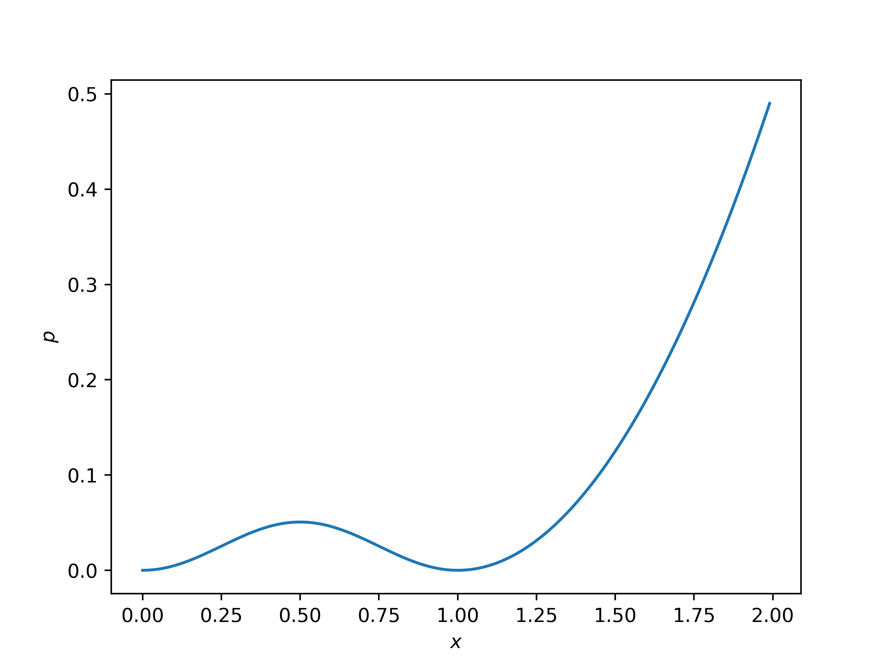
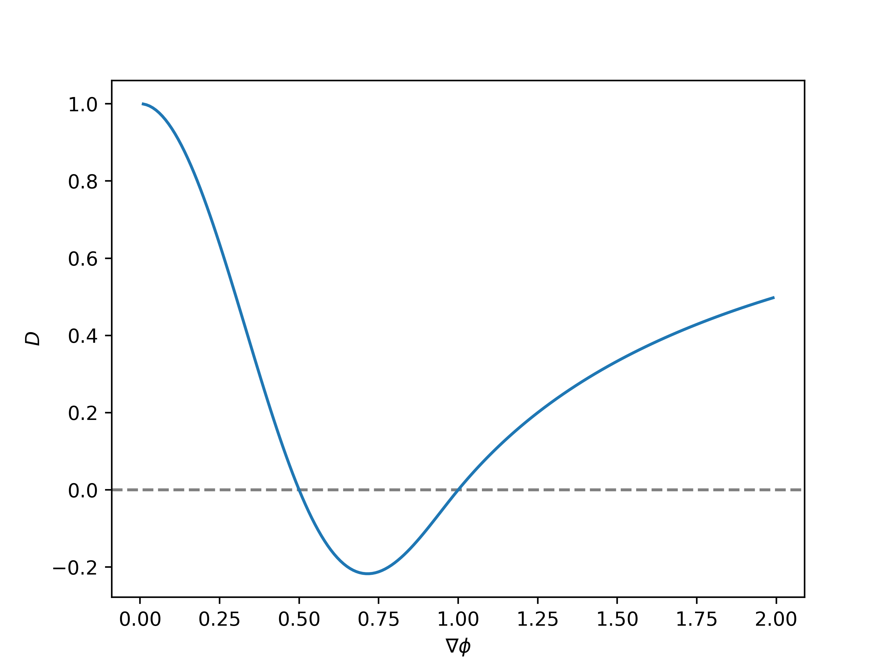

# Distance Regularized Level Set Evolution and Its Application to Image Segmentation

*Wangqian Miao*
*Materials Dept, UCSB*
06/2022
> *C. Li, C. Xu, C. Gui and M. D. Fox,* "Distance Regularized Level Set Evolution and Its Application to Image Segmentation," *doi: 10.1109/TIP.2010.2069690.*

---

# Introduction

In image processing and computer vision, the level set method is introduced in the context of active contour $C(s, t):[0, 1]\times[0, \infty] \rightarrow \mathbb{R}^2$.
- $s$: spatial parameter in $[0, 1]$,
- $t$: time evolution.
- The curve evolution can be expressed as:
  $$\frac{\partial C(s, t)}{\partial t} = F \mathcal{N}$$
$F$ is the speed function controls the motion of $C$, $\mathcal{N}$ is the inward normal vector to $C$.

---
# The Level Set Method

<!-- _footer: V. Caselles, 1993. R. Malladi, 1995. -->
The curve (or the interface) evolves according to:
$$\frac{\partial C(s, t)}{\partial t} = F \mathcal{N}$$
At all times the interface is the zero level set of $\phi$:
$$\phi(C(s, t)) = 0$$
The total time derivative should vanish:
$$0 = \frac{\mathrm{d}\phi}{\mathrm{d}t} = \nabla \phi \frac{\mathrm{d} C}{\mathrm{d} t} + \partial_t \phi$$
Then an evolution equation for $\phi$:
$$\boxed{\partial_t \phi = -F|\nabla\phi|}$$

---
# Motivation

We need to maintain the LSF in a good condition, not too steep and too flat.
- Sign distance funciton: $|\nabla\phi|=1$ 
- A standard method: $\phi_t = \mathrm{sign}(\phi)(1-|\nabla\phi|)$

**Problem**: Speed function $F$ does not have a component for preserving the LSF as a signed distance function.

**What the authors do**: Design a *general variational level set formulation*:
  - Instead of design $F$ $\rightarrow$ use a **energy variantional scheme**.
    * Distance regularization term $\rightarrow$ keep the property of LSF.
    * External Energy term $\rightarrow$ guide the motion of zero level set.

---

# Energy Formulation With Distance Regulation

  Let $\phi$: a level set defined on a domain $\Omega$. $E(\phi)$: an energy funcitonal.
$$E(\phi) = \mu R_p(\phi) + E_{\mathrm{ext}}(\phi)$$
- Distance regularization term $R_p(\phi)\rightarrow$ keep the property of LSF. ($\mu > 0$)
  $$ R_p(\phi) =\int_\Omega p(|\nabla\phi|) \,\mathrm{d}\mathbf{x}$$
  $p$ is energy density function.
- External Energy term $E_{\mathrm{ext}}(\phi), \rightarrow$ guide the motion of zero level set.
- Minimize $E(\phi)$ is to find the steady state solution of the gradient flow equation:
  $$ \boxed{\partial_t \phi = -\partial_\phi E}$$
* **Note**: $\partial_\phi E$ is the steepest descent direction of the functional $E(\phi)$. The gradient flow is also called *steepest descent flow or gradient descent flow*.

---

# Distance Regularization Effect

Gradient flow of $\mu R(\phi)$ 
$$ \phi_t =-\mu \partial_\phi R= \mu \mathrm{div}(d_p(|\nabla\phi|)\nabla\phi)$$
Expressed in the form of a diffusion equation:
$$ \phi_t = \mathrm{div} (D\nabla\phi)$$
Diffusion rate $D= \mu d_p(|\nabla \phi|)$:
- $d_p(s) \equiv {p'(s)}/{s}$.
* **Forward-and-Backward (FAB) diffusion**: 
  * $D$ is positive, diffusion is **forward diffusion** $\rightarrow$ **decreases** $|\nabla \phi|$.
  * $D$ is negative, diffusion is **backward diffusion** $\rightarrow$ **increases** $|\nabla \phi|$. 
  * Force $|\nabla \phi|$ to be close to one of the minimum points of the potential function $p(s)$

---
# How to design energy density function $p$

* A naive choice: $p_s = s^2/2$
  - A strong smoothing effect, flatten the LSF, cannot maintain signed distance property $|\nabla\phi|=1$.
* Another choice: $p_s = (s-1)^2/2$
    - $|\nabla \phi|>1$, diffusion rate $\mu d_p(|\nabla\phi|)$ is positive.
      -  diffusion is forward, decreases  $|\nabla \phi|$.
    - $|\nabla \phi|<1$, diffusion rate $\mu d_p(|\nabla\phi|)$ is negative.
      -  diffusion is backward, increases  $|\nabla \phi|$.
    * **Problem: (Unbounded)** 
      * $\mu d_p(|\nabla \phi|) = \mu(1-(1/|\nabla\phi|)$ goes to negative infinity when $|\nabla\phi|\rightarrow 0$.

---
# <!-- fit --> Double Well Energy Density Function

Design a double well energy density function $p(s)$:
- if $s\leq 1$: 
    $p_s = (1-\cos(2\pi s))/(2\pi)^2$.
- if $s\geq1$:
     $p_s = (s-1)^2/2$
- Diffusion rate is bounded
  $|\mu d_p(|\nabla\phi|)\leq \mu$

---
# <!-- fit -->  Double Well Energy Density Function
* For $|\nabla \phi| >1$, diffusion rate $D>0$, forward diffusion, decreases $|\nabla \phi|$.
* For $1/2<|\nabla \phi| <1$, diffusion rate $D<0$, backward diffusion, increases $|\nabla \phi|$.
* For $|\nabla \phi| <1/2$, diffusion rate $D>0$, forward diffusion, decreases $|\nabla \phi| \rightarrow 0$.

---

# Reinitialization Experiment

---
# Applicaiton: Edge Based Image Segmentation

<!-- _footer: 'Caselles et al. 93/97, Caselles et al. 95, Kichenassamy et al. 95' 
 -->

* $I$: an image on a domain $\Omega$. $g$: an edge indicator function to smooth image$^1$: 
  $$g \equiv  \frac{1}{1+ |\nabla G_\sigma * I|}$$
  **Note**: $g$ usually takes smaller values at object boundaries than at other locations.
* Total Energy functional $E_\phi$: 
  $$E(\phi) = \mu R_p(\phi) + \lambda L_g(\phi) + \alpha A_g(\phi)$$
* $L_g(\phi)$: the line integral of $g$ along zero level contour of $\phi$:
  $$L_g(\phi) \equiv \int_\Omega g\delta(\phi)|\nabla \phi| \, \mathrm{d}\mathbf{x}$$
  **Note**: $L(\phi)$ is minimized when the zero level contour of $\phi$ is located at the object boundaries$^1$.
* $A_g(\phi)$: a weighted area of $\{\mathbf{x}:\phi(\mathbf{x})<0\}$ to speed up evolution process:
  $$A_g(\phi) \equiv \int_\Omega gH(-\phi)\, \mathrm{d}\mathbf{x}$$

---
# Gradient Flow Function

This energy functional can be minimized by solving the following gradient flow:
$$
\boxed{\phi_t = \mu \mathrm{div} (d_p(|\nabla \phi|)\nabla \phi) + \lambda \delta(\phi) \mathrm{div}\left(g \frac{\nabla \phi}{|\nabla \phi|}\right) + \alpha g \delta(\phi)}
$$

2D case:
- Approximate spatial derivatives $\partial_x \phi$ and $\partial_y \phi$ by **central differences**.
- Approximate $\partial_t \phi$ by the **forward difference**.

---
# Experiment Results (1) 

|Image | Contour |Final Grid |
|----------|:-------------:|------:|
| |   |  |

[Video](./ground.html)

---
# Experiment Results (2) 

| Image | Contour |Final Grid |
|----------|:-------------:|------:|
|  | | |

[Video](./twocell.html)

---

# Comments 

- DRLSE formulation has an **intrinsic** capability of maintaining regularity of the level set function, *particularly the desirable signed distance property in a vicinity of the zero level set*.
- Demo: an edge-based active contour model for image segmentation. Easy to implement, runs fast, not so many paramenters.
# Thank You!

