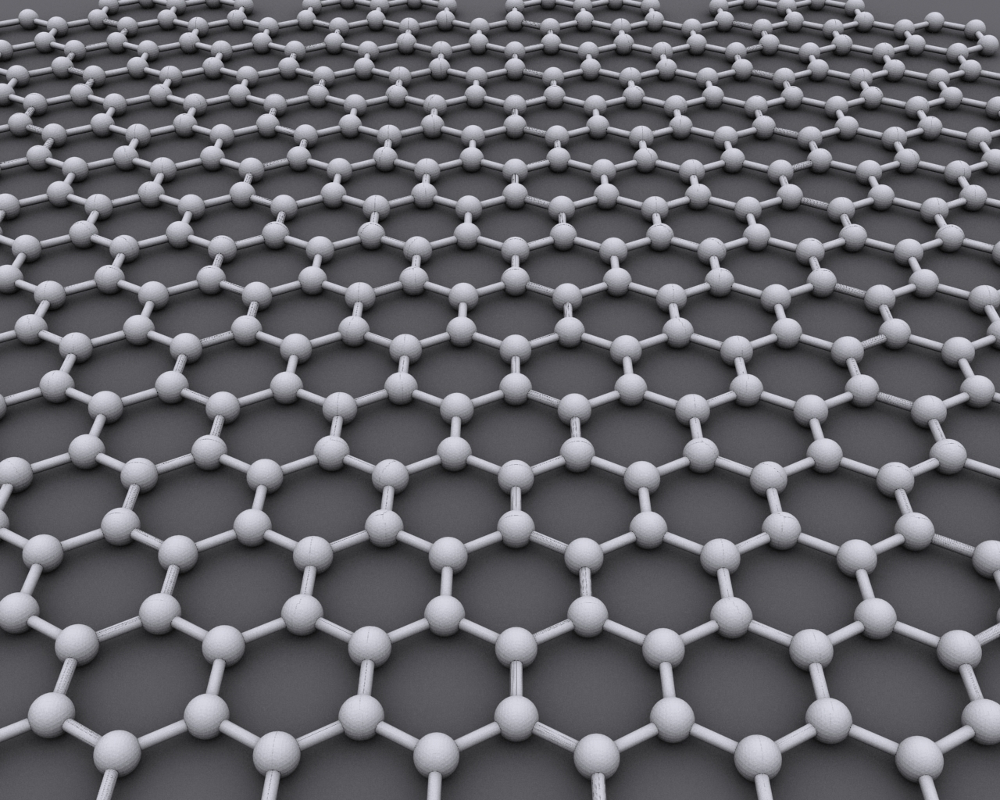
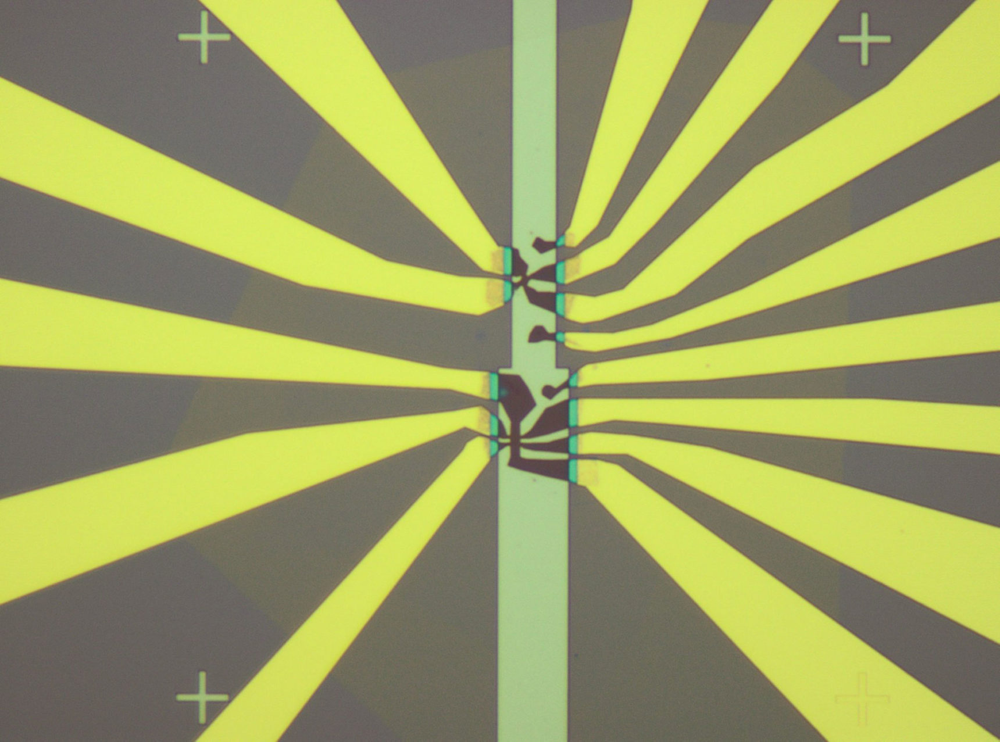

# What I Do and Why They are Important
- Wangqian Miao
- Materials Dept, UCSB
- 03/2022

---
## Material Science

- Which Kind of Material?
  - Polymer?
  - Plastic?
  - Alloys?
  - ... 👋👋
- What I study is *Quantum Material*!
  - Totally fundamental research.
  - Can not be applied for a *long* time.

- Through which way?
  - ✍️ I do theory!

---

## What is Quantum Material

>Quantum materials is an umbrella term in condensed matter physics that encompasses all materials whose essential properties cannot be described in terms of *semiclassical particles* and *low-level quantum mechanics*.  
>Definition from Wikipedia

- One example
  - 🚩 Graphene...

- They have some novel phenomena
  - 🚩 Superconductivity... 
  - The resistance drop to 0 when we cool down the material.
---
## Moiré Pattern

- Moiré Pattern are large-scale *interference* patterns.
- Produced when an opaque ruled pattern with transparent gaps is overlaid on another similar pattern. 
- Two patterns must not be completely identical, but rather *displaced* or *rotated*.
  

---

## 🤔 What will happen if we twist the graphene to make a Moire pattern?

---
## Twisted Bilayer Graphene

- Stack one layer of Graphene over the other one.
- Rotate a small angle, for around 1.1$^\circ$.
- Some interesting phenomena appear...

---
## Twisted Bilayer Graphene

*Allan H. Macdonald, UT Austin, 2011*
- Theoretical Model

*Jarillo-Herrero Lab, MIT, 2018*
- The first TBG device. 
- The dark material: Stacked graphene sheets.
- Varying the voltage in the electrodes, the electrical properties can be
controlled.

---

## Mystery... 

- An electric field switched the device into an insulator. 
  If cranking up the field higher, it suddenly switched again,
  into a **superconductor**.

- The physics mechanism behind this phenomena?
- 👨‍🚀 I need to do something!
  - Develop theoretical model.
  - Predict and compare the results from experiments.

---

## Why Fundamental Research

- *What can we use your research for?* 
- *Does it have any application?*

1. Outcome often unknown
2. Researchers working at the frontier of knowledge.
3. Research extends current knowledge. 

It's our *mission* to inspire next generation.
