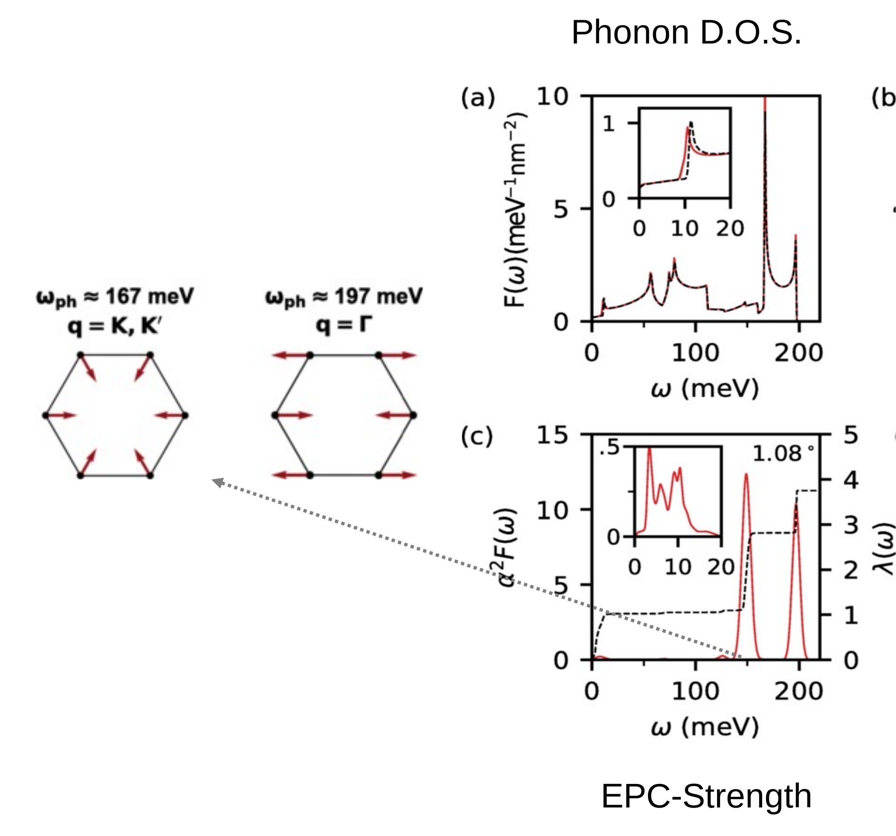

<!-- footer: 'Preliminary Examination | 7th, Dec, 2022' -->
<!-- 
_class: lead
_paginate: false
 -->

# Lattice Reconstruction and Moiré Phonons in Twisted Bilayer Graphene

*Wangqian Miao*

---

# Introduction
<!-- _footer: 'Cao, Nature, 2018' Twisted -->

Twisted Bilayer Graphene (TBG), a platform to realize novel quantum phenomena. [Cao, Nature, 2018.]()
- Superconductivity, Orbital magnetism, Correlated insulating phase.
- [Lu, Nature, 2019](), `BI`: Band Insulator, `SC`: Superconductivity, `CS`: Correlated State.

---
# Outline

**In this presentation**:
Single particle picture
- Lattice Reconstruction in TBG
  - Insulator at $n=\pm 4$
- Moiré Phonons
  - iTO Phonons induced distortion
  - Insulator at other integer filling

---

# Structure of Twisted Bilayer Graphene

- Start from an AA stacking Bilayer Graphene and twist.
- Moiré Pattern at small twist angle.
- **AA, AB, BA, SP(DW)** stacking area.  
- $D_6$ point group symmetry: $C_{3z}, C_{2x}, C_{2y}$.

  
---

# Electronic Structure

- **B&M model predictions [Bistritzer and MacDonald, P.N.A.S. 108,12233 (2011)]().**
  - Start Point is a rigid structure. 
  - There are still Dirac Nodes.
  - There are **magic angles** where Fermi velocity vanishes.
  - No Band Gap at magic angle.
- **Question**: In experiments, MATBG is insulating at $n=\pm 4$, confilts with the band theory.

---
# Lattice Reconstruction in TBG

- **Small Scale DFT calculation for bilayer graphene system [Gargiulo etc, 2018 2D Mater. 5 015019]()**
  - AB/BA stacking and SP(DW) areas are more energetically favorable.
- How about atomic relaxation in TBG?
  - *Competition* of minimization of interlayer energy and the reaction of in plane strain field.
  - Numerical Modeling:
    - Density Functional Theory $\rightarrow$ vdW functional, hard to perform.
    - Molecular Dynamics $\rightarrow$ classical force field fitted from small scale DFT.
    - Continuum Theory $\rightarrow$ empirical elastic theory.

<!--  -->

---

# Relaxed Strucuture and Expremental Observation

**Simulation [Angeli etc, P.R.B, 98, 235137]() and exprements [Choi etc, Nat. Phys., 15, 1174–1180 (2019)]()** show:
- Lattice reconstruction: twist angle below $\theta^* = 1.2^\circ$.
- maximise AB/BA area and shrink AA area, sharp DW area.
- corrugation in $z$ direction.

  

---

# Atomistic Modeling of TBG
- The single particle Hamiltonian:
  $$ \mathcal{H} = - \sum_{i, j} t(\mathbf{r}_i - \mathbf{r}_j) c^\dagger_i c_j $$
- Slater Koster parameters describing hopping between $p_z$ orbitals of carbon atoms in the $real$ positions:
$$t(\mathbf{r}) = -V_\pi\left(1-\frac{r_z^2}{r^2}\right)-V_\sigma\frac{r_z^2}{r^2}$$
- $$r_z = \mathbf{r} \cdot \mathbf{e}_z, V_\pi = V_\pi^0 e^{-(r-a_0)/r_0}, V_\sigma = V_\sigma^0 e^{-(r-d_0)/r_0}.$$
* More accurate $t$ can be calculated in wannierized TB parameters **[Fang, P.R.B., 93, 235153]()**.
* Huge sparse matrix $\rightarrow$ Lanczos Algorithm.

--- 

# Band Structure Near the First Magic Angle
1. Open band Gaps at the first magic angle. [**Lucignano, P.R.B 99, 195419**]().
   - (DFT) vdw-DF2 exchange-correlation functional, *5760 physical cores, 30 days*.
2. For magic angle:
   - (Continuum Theory+TB) Fermi velociy $v_\text{F} \rightarrow 0$, no other magic angles. [**Carr, P.R. Research 1, 013001**]().
   - (MD+TB) Band width. The first magic angle is stablized around $1^\circ$ [**Leconte, P.R.B 106, 115410**]().

---

# Band Strucutre Near the First Magic Angle

---

# Brief Summary

- Lattice Reconstruction in TBG at small twist angle
  - Theoretical technique:
    - Effective simulaiton using MD with modern force field
    - Band Structure Calculation using atomistic TB model
  - Experimental technique:
    - STM, TEM, Raman
  - Conclusion
    - AA stacking area will shrink, AB/BA stacking area expand, sharp DW area
    -  Corrugation effect
    - Open band gap, stabelize the first magic angle
* How about phonons?
---

# Phonons

**How to solve moiré phonon problem in TBG?**

- Have a relaxed strucuture, use MD
- Calculate Force constant by Frozen Phonon method
  - Force constant $\Phi$
   $$\Phi(\mathbf{r}_i-\mathbf{r}_j)=\frac{\partial^2 U}{\partial \mathbf{r}_i \partial \mathbf{r}_j} = - \frac{\partial \mathbf{F}_{j}}{\partial \mathbf{r}_i}$$
  - Fourier Transform $\rightarrow$ Dynamic matrix $\mathbf{D}(\mathbf{q})$
- Diagonalize $\mathbf{D}(\mathbf{q})$ $\rightarrow$    
  - Phonon Bands: $\omega(\mathbf{q})$
  - Polarization Vector: $\mathbf{u}(\mathbf{q})$ 

---

# Low Frequency Moiré Phonons

**[Liu etc, Nano Lett. 2022, 22, 19, 7791–7797]()**

---

# High Frequency Moiré Phonons
**Valley Jahn-Teller Effect in TBG,   [Angeli etc, P.R.X, 9, 041010]().**
- Calculate phonon spectrum comprising 33492 modes
- Some special modes that resemble global vibrations of the moire supercell, as a ultralarge molecule
- These modes have the same accidental double degeneracy as the electonic bands
- The degenarate phonon at $\Gamma$ comprises one $A_1$ mode even under $C_{2y}$ and the other $B_1$ mode odd.

---

# $U_v(1)$ symmetry 
- Valley decoupled, emergent $U_v(1)$ symmetry.
- Accidential symmetry along $C_{2y}$ invariant line.
  - $T_3 = \sigma_0 \tau_3 \mu_0/2, T_1 = \sigma_1\tau_1\mu_3/2, T_2 = \sigma_1 \tau_2 \mu_3/2$ 
  -  $\sigma$: moire sublattice, $\tau$ valley space, $\mu$: $C_x=\pm 1$ space.
* How to break this accidential symmetry?
  * Coulomb Interaction can do.
  * How about lattice distortion?

---
# Real Space Distortion and Frozen Phonon Band

- iTO like vibrations localized at AA stacking area and DW area.
- Frozen phonon band strucuture
  - Add displacement on the relaxed carbon atoms
  - Feed updated atom coordinates to atomistic TB model
  - The bands are Gapped out, but still topological.
    - insulating at CNP
    - odd winding of Wilson loop and edge states

---
# $E \otimes e$ Jahn-Teller Effect

* Accidential degeneracy along $C_{2y}$ invariant lines:
    - $K-\Gamma, M-\Gamma$, $\mathrm{SU}(2)$ algebra: $T_3 = \sigma_0 \tau_3 \mu_0/2, T_1 = \sigma_1\tau_1\mu_3/2, T_2 = \sigma_1 \tau_2 \mu_3/2$ 
    - $\sigma$: moire sublattice, $\tau$ valley space, $\mu$: $C_x=\pm 1$ space.
* $E \otimes e$ Jahn-Teller effect
  - a doubly degenerate phonon mode coupled to a doubly degenerate band  
* $\mathcal{H}_{\text{e-ph}} = -g (q_1 T_1 + q_2 T_2)$
    - not commute with $\tau_3$
    - invariant along $C_{2y}$ line
    - commute with $J_3 = T_3 + L_3 = \tau_3/2+ \mathbf{q}\times\mathbf{p}$

---
# Insulating State at other Commensurate Fillings

- Frozen two degenarate phonon at $M$ point
- Band Gap through DOS $n =\pm 2, \pm 4$

---
# Electron Phonon Coupling in MATBG

**A more detailed calculation [Choi etc, P.R.B, 98, 241412(R), P.R.L. 127, 167001.]()**

- Phonon D.O.S. at high frequency is almost the same as the one of AB stacking bilayer grphene.
  - Moire potential can be savely ignored.
- Full electron phonon coupling strength hints strong coupling with iTO phonons (167meV and 197meV)

---

# Raman Spectroscopy
**Localization of lattice dynamics [Gadelha etc, Nature, 405–409 (2021)]()**
- $\theta = 0.9^\circ$
- iTO Phonon is raman active
- Nano Raman Spectroscopy technique

---

# Brief Summary

- Moiré Phonons of MATBG
  - Theoretical technique
    - Calculate Force constant using frozen phonon method
    - Phonon D.O.S, real space distortion, frozen phonon band
  - Expremental technique
    - STM, nano Raman
  - Conclusion
    - Low frequency phonon $\rightarrow$ stripe charge order
    - iTO phonon, strong EPC, break $U_v(1)$ symmetry.

---

# Thank You! 

- Professor Susanne Stemmer (Chair)
- Professor Xi Dai (Supervisor)
- Professor Stephen Wilson
- Professor Bolin Liao

---

# Q&A