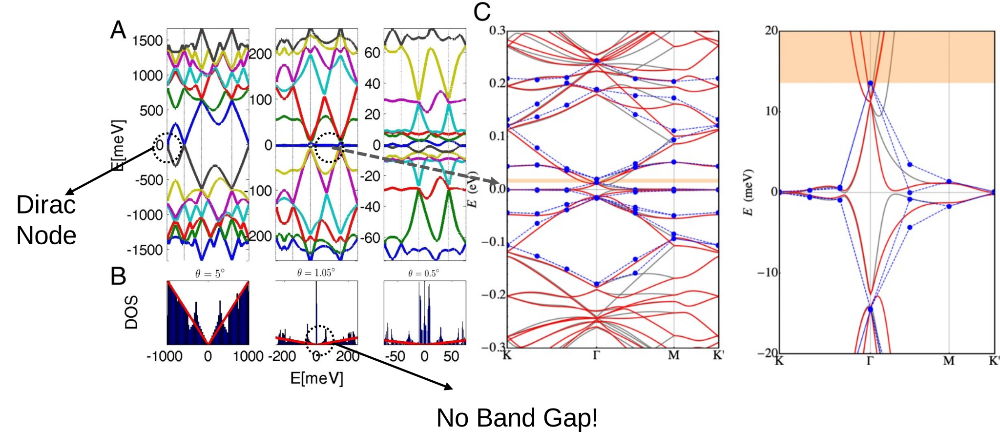

<!-- footer: 'Preliminary Examination | 7th, Dec, 2022' -->
<!-- 
_class: lead
_paginate: false
 -->

# Lattice Reconstruction and Moiré Phonons in Twisted Bilayer Graphene

*Wangqian Miao*

---

# Introduction
<!-- _footer: 'Cao, Nature, 2018' Twisted -->

Twisted Bilayer Graphene (TBG), a platform to realize novel quantum phenomena. [Cao, 2018.]()
- Superconductivity. 
- Orbital magnetism.
- Correlated insulating phase.
- ....

**In this presentation**:
- Lattice Reconstruction in TBG and its concequence
- Phonons

---

# Structure of Twisted Bilayer Graphene

- Start from an AA stacking Bilayer Graphene and rotate.
- Moire Pattern at small twist angle.
- **AA, AB, BA** stacking area.  

  
---

# Electronic Structure

- **B&M model predictions [Bistritzer and MacDonald, PNAS 108,12233 (2011)]().**
  - Start Point is rigid TB
  - There are still Dirac Nodes
  - There are **magic angles** where Fermi velocity vanishes
  - No Band Gap at magic angle
- Question: In experiments, MATBG is insulating at $n=\pm 4$, confilts with the band theory.

---
# Lattice Reconstruction in TBG

- The start point of original B&M model is **rigid structure**.
- **Small Scale DFT calculation for bilayer graphene system [Gargiulo etc, 2018 2D Mater. 5 015019]()**
  - AB/BA stacking and SP (saddle point) areas are more energetically favorable.
- How about atomic relaxation in TBG?
  - DFT, Molecule Dynamics (modern force field)...

---

# Relaxed Strucuture and Expremental Observation

**Simulation [Angeli etc, PRB 98, 235137]() and exprements [Choi etc, Nat Phys, 15, 1174–1180 (2019)]()** show:
- maximise AB/BA area and shrink AA area
- corrugation in $z$.
- vertex
  

---

# Atomistic Modeling of TBG
- The single particle Hamiltonian:
  $$ \mathcal{H} = - \sum_{i, j} t(\mathbf{r}_i - \mathbf{r}_j) c^\dagger_i c_j $$
- Slater Koster parameters describing hopping between $p_z$ orbitals of carbon atoms in the $real$ positions:
$$t(\mathbf{r}) = -V_\pi\left(1-\frac{r_z^2}{r^2}\right)-V_\sigma\frac{r_z^2}{r^2}$$
- $r_z = \mathbf{r} \cdot \mathbf{e}_z, V_\pi = V_\pi^0 e^{-(r-a_0)/r_0}, V_\sigma = V_\sigma^0 e^{-(r-d_0)/r_0}.$
* More accurate $t$ can be calculated in wannierized TB parameters.

--- 

# Relaxed Band Structure $\theta=1.08^\circ$

---

# Brief Summary

- Lattice Reconstruction in TBG at small twist angle
  - Theoretical technique:
    - Effective simulaiton using MD with modern force field
    - Band Structure Calculation using Atomistic TB model
  - Experimental technique:
    - STM, TEM, Raman
  - Conclusion
    - AA stacking area will shrink, AB/BA stacking area expand, Corrugation effect
    - Open band gap, stabelize magic angle
* How about phonons?
---

# Phonons

**How to solve moiré phonon problem in TBG?**

- Have a relaxed strucuture, use MD
- Calculated Force constant by Frozen Phonon method
  - Force constant $\Phi$
   $$\Phi(\mathbf{r}_i-\mathbf{r}_j)=\frac{\partial^2 U}{\partial \mathbf{r}_i \mathbf{r}_j} = - \frac{\partial \mathbf{F}_{j}}{\partial \mathbf{r}_i}$$
  - Fourier Transform $\rightarrow$ Dynamic matrix $\mathbf{D}(\mathbf{k})$
- Diagonalize $\mathbf{D}(\mathbf{k})$ $\rightarrow$  Phonon Band and real space distortion 

---

# Low Frequency Moiré Phonons

**[Liu etc, Nano Lett. 2022, 22, 19, 7791–7797]()**

---

# High Frequency Moiré Phonons
**Valley Jahn-Teller Effect in TBG,   [Angeli etc, PRX, 9, 041010]().**
- Calculate phonon spectrum comprising 33492 modes
- Some special modes that resemble global vibrations of the moire supercell, as a ultralarger molecule
- These modes have the same accidental double degeneracy as the electonic bands
- The degenarate phonon at $\Gamma$ comprises one $A_1$ mode even under $C_{2y}$ and the other $B_1$ mode odd.

---
# Real Space Distortion and Frozen Phonon Band

- iTO like vibrations localized at AA stacking area and DW area.
- Frozen phonon band strucuture
  - Add displacement on the relaxed carbon atoms
  - Feed updated atom coordinates to atomistic TB model
  - The bands are Gapped out, but still topological.
- Suggest a $E \otimes e$ Jahn-Teller effect
  - a doubly degenerate mode coupled to a doubly degenerate band

---
# Electron Phonon Coupling in MATBG

**A more detailed calculation [Choi etc, PRB, 98, 241412(R), PRL. 127, 167001.]()**

- Phonon D.O.S. at high frequency is almost the same as the one of AB stacking bilayer grphene.
  - Moire potential can be savely ignored.
- Full electron phonon coupling strength hints strong coupling with iTO phonons (167meV and 197meV)

---

# Raman Spectroscopy
**Localization of lattice dynamics [Gadelha etc, Nature, 405–409 (2021)]()**
- $\theta = 0.9^\circ$
- iTO Phonon is raman active
- Nano Raman Spectroscopy technique

---

# Brief Summary

- Moiré Phonons of MATBG
  - Theoretical technique
    - Calculate Force constant using frozen phonon band
    - Phonon D.O.S, real space distortion, frozen phonon band
  - Expremental technique
    - STM, nano Raman
  - Conclusion
    - Low frequency phonon $\rightarrow$ stripe charge order
    - iTO phonon, strong EPC.

---

# Thank You! 