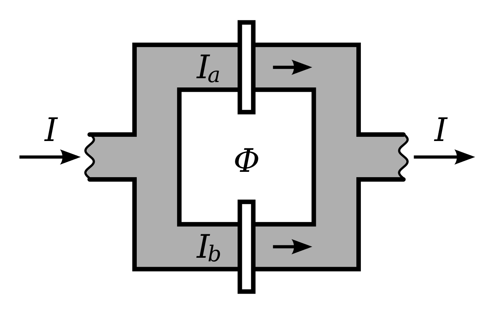
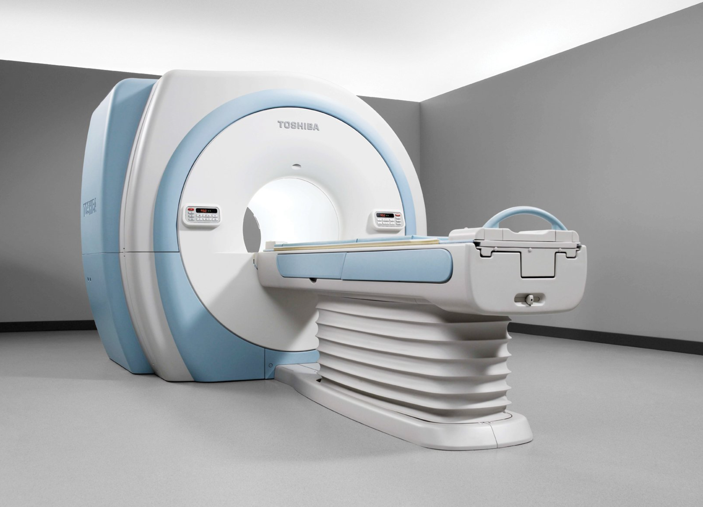
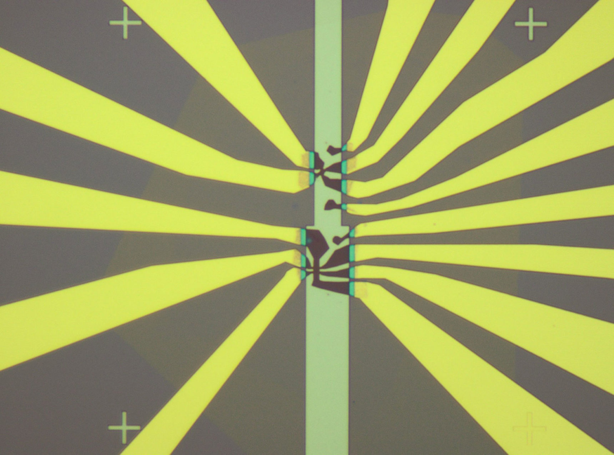

# Superconductivity and Superconductor
- Wangqian Miao
- Materials Dept, UCSB
- 02/2022

---
## Discovery of Superconductivity

- 🏅 1913 Nobel Prize in Physics.
- Discovered by *Kamerlingh Onnes* in 1911 during first low temperature measurements to liquefy helium. 
- Whilst measuring the resistivity of pure Hg he noticed that the electrical resistance dropped to zero at 4.2K.

---

## General Properties 

1. 🚩 Zero resistance (Kammerlingh-Onnes, 1911) at $T<T_c$. The temparature $T_c$ is critical one.
2. 🚩 Superconductivity can be destroyed by an external magenetic field 
$H_c$ which is also called a cirtical one. (Kammerlingh-Onnes, 1914)
3. 🚩 Magnetic filed does not penetrate superconductor. (Meissner 1933)

---

## The Superconducting Elements

- Transition temperatures (K) and critical fields are generally low.
- Metals with the highest conductivities are not superconductors. 

---

## Superconductivity in Alloys and Oxides

---

## Josephson Effect

-  An example of a macroscopic quantum phenomenon.
-  Consists of thin layer of insulating material placed between two superconductors
-  Insulator acts as a barrier to the flow of electrons.

---

## Cooper Pair

- Quantum tunnelling occurs when a pair of electron moves through a space at junction caused josephson current.

-  a Cooper pair is a pair of electrons bound together at low temperatures first described in 1956 by American physicist Leon Cooper.

---

## Some Application

- Quantum-mechanical circuits: *SQUIDs* (superconducting quantum interference devices) , superconducting qubits...
- Precision metrology, the *NIST* (National Institute of Standards and Technology) standard for one volt is achieved by an array of 20,208 Josephson junctions in series.

---

## Superconducting Quantum Interference Devices (1)

- No magnetic field $B$.
- Recap: Electrons tunnel through the junctions.
- Current made to flow around 
the loop through both Josephson junctions, and 
$I_a = I_b = \frac{1}{2}I$ 

---

## Superconducting Quantum Interference Devices (1)

- Add magnetic field $B$.
- Due to superconductivity, Magnetic flux $\Phi=BS$ shoud be:
$\Phi = n \Phi_0$
- Magnetic field through the loop causes a phase difference between electrons, affects current through the loop, then $I_a \neq I_b$.
- Potential difference across the loop can be detected.

---

## Application: Biomagnetism

- Processes in animals produce small magnetic fields, $10^{-12} – 10^{-9}$ Tesla.
- Fields associated with neural activity can be imaged by machines based on an array of SQUIDs
- Physics principle behind MRI.

---

## Moiré Pattern

- Moiré Pattern are large-scale *interference* patterns.
- Produced when an opaque ruled pattern with transparent gaps is overlaid on another similar pattern. 
- Two patterns must not be completely identical, but rather *displaced* or *rotated*.
  

---

## 🤔 What will happen if we twist the graphene to make a Moire pattern?

---
## Twisted Bilayer Graphene

- Stack one layer of Graphene over the other one.
- Rotate a small angle, for around 1.1$^\circ$.
- Some interesting phenomena appear...

---
## Twisted Bilayer Graphene

*Allan H. Macdonald, UT Austin, 2011*
- Theoretical Model

*Jarillo-Herrero Lab, MIT, 2018*
- The first TBG device. 
- The dark material: Stacked graphene sheets.
- Varying the voltage in the electrodes, the electrical properties can be
controlled.

---

## Mystery... 

An electric field switched the device into an insulator. 
If cranking up the field higher, it suddenly switched again,
 into a **superconductor**.

The physics mechanism behind this phenomena?

