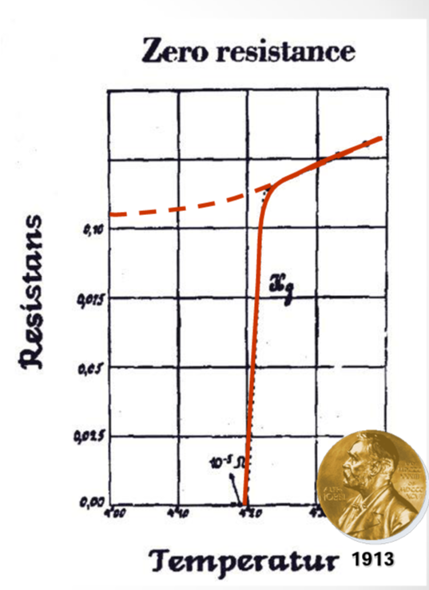
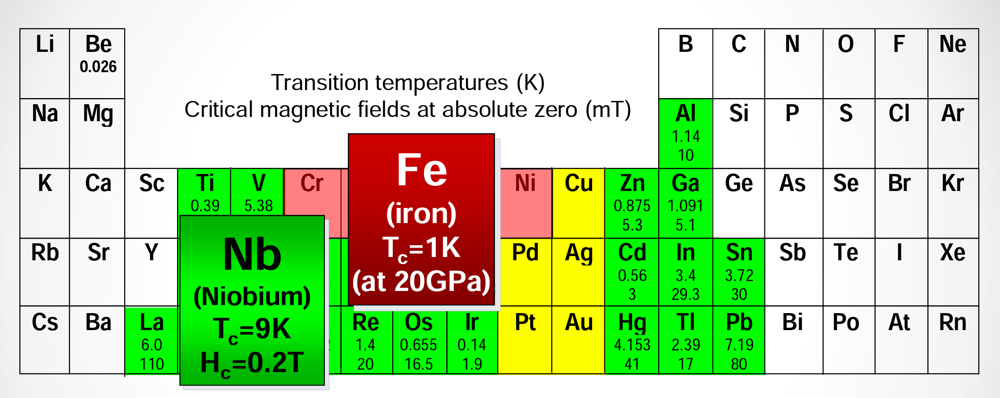

# Superconductivity and Superconductor
- Wangqian Miao
- Materials Dept, UCSB
- 12/2021

---
## Discovery of Superconductivity

- 🏅 1913 Nobel Prize in Physics.
- Discovered by *Kamerlingh Onnes* in 1911 during first low temperature measurements to liquefy helium. 
- Whilst measuring the resistivity of pure Hg he noticed that the electrical resistance dropped to zero at 4.2K.
- In 1912 he found that the resistive state is restored in a magnetic field or at high transport currents. 

---

## General Properties 

1. 🚩 Zero resistance (Kammerlingh-Onnes, 1911) at $T<T_c$. The temparature $T_c$ is critical one.
2. 🚩 Superconductivity can be destroyed by an external magenetic field 
$H_c$ which is also called a cirtical one. (Kammerlingh-Onnes, 1914)
3. 🚩 Magnetic filed does not penetrate superconductor. (Meissner 1933)

---

##

- Transition temperatures (K) and critical fields are generally low.
- Metals with the highest conductivities are not superconductors. 
