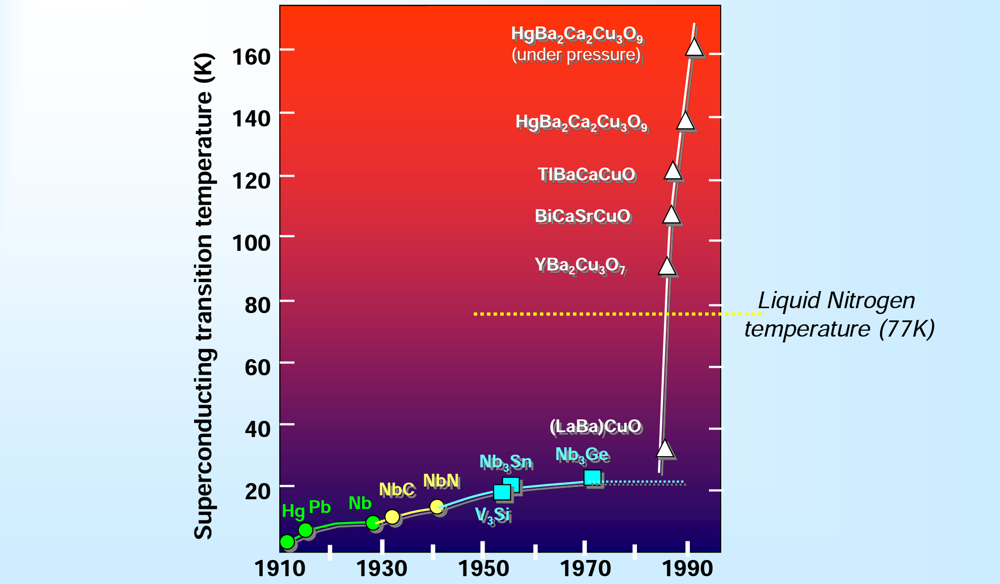
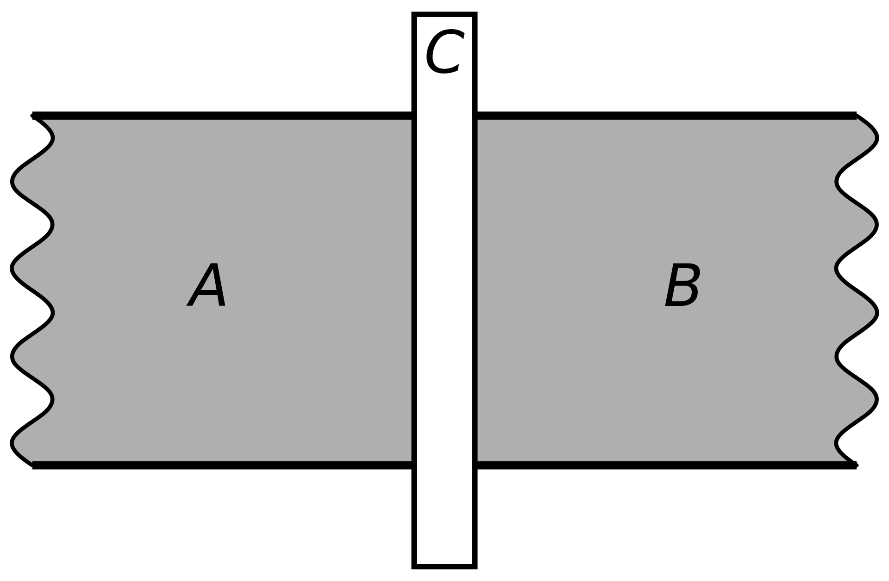
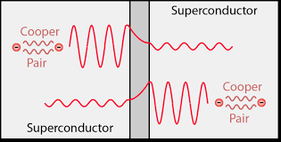
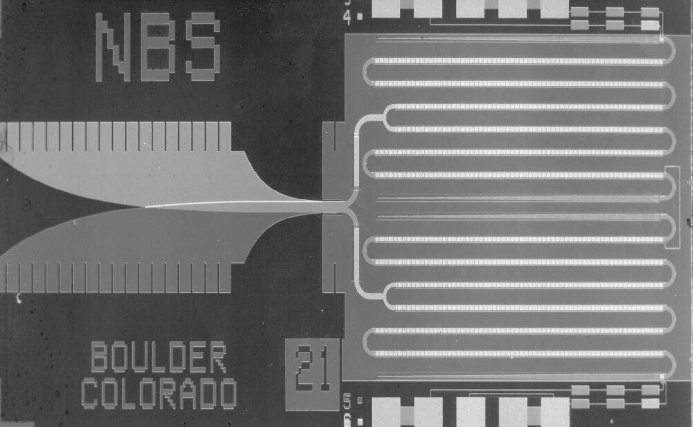

# Superconductivity and Superconductor
- Wangqian Miao
- Materials Dept, UCSB
- 02/2022

---
## Discovery of Superconductivity

- 🏅 1913 Nobel Prize in Physics.
- Discovered by *Kamerlingh Onnes* in 1911 during first low temperature measurements to liquefy helium. 
- Whilst measuring the resistivity of pure Hg he noticed that the electrical resistance dropped to zero at 4.2K.

---

## General Properties 

1. 🚩 Zero resistance (Kammerlingh-Onnes, 1911) at $T<T_c$. The temparature $T_c$ is critical one.
2. 🚩 Superconductivity can be destroyed by an external magenetic field 
$H_c$ which is also called a cirtical one. (Kammerlingh-Onnes, 1914)
3. 🚩 Magnetic filed does not penetrate superconductor. (Meissner 1933)

---

## The Superconducting Elements

- Transition temperatures (K) and critical fields are generally low.
- Metals with the highest conductivities are not superconductors. 

---

## Superconductivity in Alloys and Oxides

---

## Josephson Effect

-  An example of a macroscopic quantum phenomenon.
-  Consists of thin layer of insulating material placed between two superconductors
-  Insulator acts as a barrier to the flow of electrons.

---

## Cooper Pair

- Quantum tunnelling occurs when a pair of electron moves through a space at junction caused josephson current.

-  a Cooper pair is a pair of electrons bound together at low temperatures first described in 1956 by American physicist Leon Cooper.

---

## Some Application

- Quantum-mechanical circuits: *SQUIDs* (superconducting quantum interference devices) , superconducting qubits...
- Precision metrology, the *NIST* (National Institute of Standards and Technology) standard for one volt is achieved by an array of 20,208 Josephson junctions in series.

