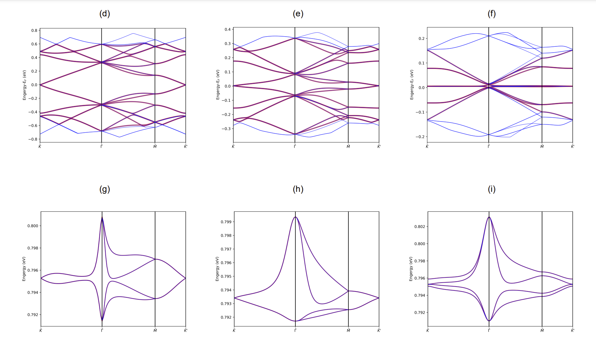

<!-- footer: 'Wangqian Miao | GS$^3$ Seminar | 10th, Aug, 2022' -->
<!-- 
_class: lead
_paginate: false
 -->

## Atomic Planewave Expansion for Subband Structure Calculations of Moiré Systems

*Wangqian Miao,*
*Prof. Xi Dai Group,*
*Materials Dept, UCSB.*

---

# Introduction and Outline
<!-- _footer: 'Cao, Nature, 2018' Twisted -->

Twisted Bilayer Graphene (TBG), a platform to realize novel quantum phenomena. [Cao, 2018.]()
- Superconductivity. 
- Orbital magnetism.
- Correlated insulating phase.
- ....

**In this presentation**:
- Several methods to calculate the related band strucuture.
- Tight Binding Planewave Projection formalism.
- Some results and commments

---

# Structure of Twisted Bilayer Graphene

- Start from an A-A stacking Bilayer Graphene and rotate.
  - AA stacking point: $D_3$ point group symmetry.
  - Hexagon center: $D_6$ point group symmetry.
- Commensurate Structure
  - A series of rotation angles. [Mele, 2010.]()
  
---

# Moiré Pattern

* Rotation angle small, Moiré pattern emerges.
* At the first magic angle, around $1^\circ$:
  * Extremely large unit cell.
  * around 10,000 atoms in a unit cell.
* Computational challenges:
  - How to determine the single particle band structure?
  - How to build an effective model Hamiltonian?

---
# Band Structure Calculations

* **Density Functional Theory**: [Uchida, 2014.]()
  - Accurate but hard to perform.
  - Corrugation and relaxation effect.
* **Tight Binding**: [Morell, 2010; Koshino, 2013.]()
  - Slater Koster scheme. 
  - Ab initio scheme.
* **Continuum Model**: [B&M, 2010; Santos, 2012; Koshino, 2013, 2015, 2018.]()
  - Rafi Bistritzer and Allan H. MacDonald.
  - Simple but capture the most important physics.
  - Not so accurate even with some corrected models. [S. Carr, 2019; Koshino, 2020.]()
* **Expectations from Physicists**
  - Not only *good band structures* but also *effective Hamiltonian*.
  - *Gap*: How to balance ...
---

# A Textbook Formalism: Slater Koster Tight Binding

- Construct Bloch wave function:
$$\psi(\mathbf{k}) = \frac{1}{\sqrt{N}} \sum_{\mathbf{R}}e^{\mathrm{i}\bar{\mathbf{k}}\cdot{(\mathbf{R}_{\mathrm{I}}+\tau_{i_\alpha})}} \phi_{p_z}(\mathbf{r}-\mathbf{R}_{\mathrm{I}}-\tau_{i_\alpha})$$
- Hopping integral determined by SK-formula:
$$t(\mathbf{r}) = -V_\pi\left(1-\frac{r_z^2}{r^2}\right)-V_\sigma\frac{r_z^2}{r^2},$$
* $r_z = \mathbf{r} \cdot \mathbf{e}_z, V_\pi = V_\pi^0 e^{-(r-a_0)/r_0}, V_\sigma = V_\sigma^0 e^{-(r-d_0)/r_0}.$
* $\approx 10,000$ atoms. TB matrix $10,000 \times 10,000$. 
  * A long time to diagonalization, but practical $\rightarrow$ Lanczos algorithm.
  * Hard to perform further calculation, like Hartree Fock, RPA ...

---
# Continuum Model
Some Key ideas:

- Construct Bloch wavefunction for each layer:
$$\begin{eqnarray}
\psi_{\mathbf{k},\alpha}^{(1)}(\mathbf{r}) &= \frac{1}{\sqrt{N}} \sum_{\mathbf{r}^{(1)}_\alpha} \mathrm{e}^{\mathrm{i} \mathbf{k} \cdot \mathbf{r}^{(1)}_\alpha} \phi_{p_z}(\mathbf{r}-\mathbf{r}^{(1)}_\alpha), \\
\psi_{\mathbf{p},\beta}^{(2)} (\mathbf{r})&= \frac{1}{\sqrt{N}} \sum_{\mathbf{r}^{(2)}_\beta} \mathrm{e}^{\mathrm{i}\mathbf{p}\cdot \mathbf{r}^{(2)}_\beta} \phi_{p_z}(\mathbf{r}-\mathbf{r}^{(2)}_\beta).
\end{eqnarray}$$
- Fourier Transform the hopping integral $\rightarrow$ *momentum conservation law of Moiré system*.
$$\boxed{\mathbf{k}=\mathbf{p}-m_1 \mathbf{G}_1-m_2 \mathbf{G}_2.}$$

---

# Continuum Model (Cont'd)

* Intralayer coupling $H$:
  * Physics from folding of Dirac cones.
  * Mini Valley concepts $\rightarrow U_{v}(1)$ symmetry
* Interlayer coupling $U$:
  * Symmetry analysis: three largest $\mathbf{k}-\mathbf{p}$ coupling.
    * $\mathbf{k}=\mathbf{p}, \mathbf{k}=\mathbf{p}-\mathbf{G}_2, \mathbf{k}=\mathbf{p}+\mathbf{G}_2.$
  * Varies smoothly in the Moiré scale.
    * $\rightarrow$ Continuum description, real space Moiré potential $U(\mathbf{r})$.

---
# K Space Picture

---
# Success of Continuum Model, But ...

- Extremely simple Hamiltonian
  - In  B&M's original paper $\rightarrow$ 6 bands model (per valley)
  - predict flat bands
- But...
  * Particle hole symmetry?
  * Accuracy? Remote bands? ([Koshino and S. Carr]())
  * Relaxation effect (no atomic configuration)?

---
# Tight Binding Planewave Expansion: Motivation

- Two kinds of periodicity in Moiré system.
  * Moiré scale periodicity
    * Full Tight Binding Description
  * Atomic scale periodicity
    * Spirit of Continuum Model
-  *Interplay between two kinds of periodicity in Moiré system*!
  $$
  \boxed{
  \psi_{\alpha, n}(\bar{\mathbf{k}}) = \frac{1}{\sqrt{N_\mathrm{m} N_\mathrm{a}}}\sum_{\mathrm{I}, i} \mathrm{e}^{ \mathrm{i}\color{red}{(\bar{\mathbf{k}}+\mathbf{G}_n})\mathbf{r}_{\mathrm{I} i \alpha}} \phi_{p_z}(\mathbf{r}-\mathbf{r}_{\mathrm{I} i \alpha}).
  }
  $$
- The matrix element of the Hamiltonian $H_{\alpha n, \beta m}$:
$$
\begin{equation}
\begin{aligned}
  &\bra{\psi_{\alpha,n}(\bar{\mathbf{k}})}{\hat{H}}\ket{\psi_{\beta,m}(\bar{\mathbf{k}})} \\
=& \frac{1}{N_\mathrm{m} N_\mathrm{a}} \sum_{\mathrm{I} \mathrm{J},ij} t(\mathbf{r}_{\mathrm{I} i \alpha}-\mathbf{r}_{\mathrm{J} j \beta})
\mathrm{e}^{-\mathrm{i}(\bar{\mathbf{k}}+\mathbf{G}_n)\mathbf{r}_{\mathrm{I} i \alpha}} \mathrm{e}^{\mathrm{i}(\bar{\mathbf{k}}+\mathbf{G}_m)\mathbf{r}_{\mathrm{I} j \beta}} \\
=&\frac{1}{N_\mathrm{a}} \sum_{ij} \color{red}{\mathrm{e}^{-\mathrm{i} \mathbf{G}_n \tau_{i\alpha}}} \color{blue}{\mathrm{e}^{-\mathrm{i} \bar{\mathbf{k}} (\bar{\tau}_{i\alpha, j\beta})} 
t(\bar{\tau}_{i\alpha, j\beta})} \color{red} {\mathrm{e}^{\mathrm{i} \mathbf{G}_m \tau_{j\beta}}}. \\
\label{eq:ele}
\end{aligned}
\end{equation}
$$
---
# Tight Binding Planewave Expansion

- A more compact expression
$$\boxed{\mathbf{H}_{\alpha\beta} = \frac{1}{N_{\mathrm{a}}}\mathbf{X}^\dagger_{\alpha} \mathbf{T}_{\alpha\beta} \mathbf{X}_{\beta}.}$$

- corresponding matrix elements:
$$
\begin{equation}
\begin{aligned}
(\mathbf{X_\alpha}^\dagger)_{n,i}  &=\mathrm{e}^{\mathrm{i}\mathbf{G}_n\tau_{i\alpha}},\\
(\mathbf{T_{1\alpha \beta}})_{i, j} &= \mathrm{e}^{-\mathrm{i} \bar{\mathbf{k}} (\bar{\tau}_{i\alpha, j\beta})},\\ 
(\mathbf{T_{2\alpha \beta}})_{i, j} &=t(\bar{\tau}_{i\alpha, j\beta}),\\
(\mathbf{T_{\alpha \beta}})_{i, j} &= \mathbf{T}_1 * \mathbf{T}_2.
\end{aligned}
\end{equation}
$$
* Concrete meaning:
  * $\mathbf{T}_1$: hopping phase. $\mathbf{T}_2$ hopping integral. 
  * $\mathbf{T}_1*\mathbf{T}_2$:  Full TB matrix!
  * $\mathbf{X}$: Planewave projector.

---

# Why Tight Binding Planewave Should be Fast ?

* Benchmarked with *WannierTools*. [Wu, 2017.]()
* No need to diagonalize *full TB*, but the projected Hamiltonian.
  * (num of  atoms, num of atoms) $\rightarrow$ ($4\times$ num of $\mathbf{G}$, $4\times$ num of $\mathbf{G}$) per valley.
  * MATBG: $(11164, 11164) \rightarrow(244, 244)$  per valley.
* The construction of *Planewave projector* $\mathbf{X}$ and *hopping integral* $\mathbf{T}_2$ is only once!
* $\mathbf{T}_1 * \mathbf{T}_2$ element-wise production.

---
# Band Structure Results

Compared with Full Tight Binding results
* Highly consistent with full tight binding result.
* Not only rigid structure, but also corrugated, relaxed structure.
* a wide range of rotation angles.
* (d)-(f) $3.0^\circ, 1.6^\circ, 1.0^\circ$.

---

#

---

# Detailed Description of Moiré Potential

- In Continuum Model:
  * Three largest components, 
  $$U(\mathbf{r})=U_0 + U_1 \mathrm{e}^{\mathrm{i}\mathbf{G}_1\cdot\mathbf{r}}+U_2\mathrm{e}^{-\mathrm{i}\mathbf{G}_2\cdot\mathbf{r}}.$$
  * $U_i: 2\times 2$ matrix for $A/B$ sublattice.
- In Tight Binding Planewave expansion:
  * Tensor form: $U_{\bar{\mathbf{k}}}(\mathbf{G}_n, \mathbf{G}_m)$.
  * $\mathbf{k}$-dependant ($\bar{\mathbf{k}}+\mathbf{G}_n = \mathbf{k}$).
  * High Order $\mathbf{G}$ components.
---

---

# Some Comments 

- How to design hopping integral $\mathbf{T}_2$?
  * Slater Koster scheme
    * Setup neighbours using KDTree. 
    * `Numpy` broadcasting.
  * Ab initio TB scheme
- Only the band structure of TBG?
  * The projection process is general.
  * Moiré phonon bands, relaxed Moiré structure.
- Further Application?
  * Electron-Electron interaction.
  * Electron-Phonon interaction (Frozen Phonon).
---
# Thank You ! 🎉🎉🎉

*Contact me through `wmiao@ucsb.edu` for any request!*
*Code released soon, stay tuned.*
