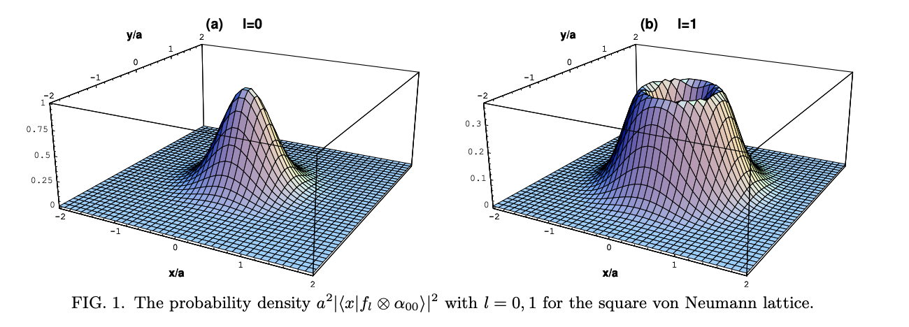

# Von Neumann Lattice
- PRB 58.1088
- Physica E 4 (1999) 37-55
---

## Von Neumann Lattice Basis

Two sets of coordinates: $(\xi, \eta)$ [relative coordinates]. $(X,Y)$[guiding center coordinates]

$$
\begin{aligned}
\xi &= (eB)^{-1}(p_y+eA_y)\\
\eta &=-(eB)^{-1}(p_x+eA_x)\\
X& = x-\xi\\
Y &= y-\eta\\
\end{aligned}
$$
The one body Hamiltonian can be written as
$$
H_0 = \frac{1}{2}m\omega_c^2(\xi^2+\eta^2)
$$
where $\omega_c=eB/m$. $H_0$ is independent of $X, Y$.(corresponds to the degenaracy of Landau level)
$$
H_0\ket{f_\ell}=E_\ell\ket{f_\ell}, E_\ell = \hbar\omega_c (\ell+\frac{1}{2})
$$

---
Use coherent state defined by 
$$
(X+\mathrm{i}Y) \ket{\alpha_{mn}} = z_{mn}\ket{\alpha_{mn}},z_{mn} = (m\omega_x+n\omega_y)a
$$
$$
\begin{array}{c}
\left|\alpha_{m n}\right\rangle=e^{i \pi(m+n+m n)+\sqrt{\pi}\left(A^{\dagger} \frac{z_{m n}}{a}-A \frac{z_{m n}^{*}}{a}\right)}\left|0\right\rangle \\
A=\frac{\sqrt{\pi}}{a}(X+\mathrm{i} Y), \left[A, A^{\dagger}\right]=1, a= \sqrt{\frac{2\pi\hbar}{eB}}
\end{array}
$$
where $m,n$ are integers and $\omega_x, \omega_y$ are complex numbers satisfy
$$
\Im[\omega_x^*\omega_y] =1
$$
$z_{mn}$ is a point on the lattice site in the complex plane with an area of the unit cell is $a^2$. We call this lattice the `magnetic von Neumann lattice` which is parameterized by $\tau = -\omega_x/\omega_y$.

- For $\tau = i$, square lattice
- For $\tau = e^{i2\pi/3}$, triangular lattice.

---
$\ket{f_{\ell} \otimes \alpha_{m n}}$ is the *basis function we need*, which is localized.
$$
\left\langle\mathbf{x} \mid f_{\ell} \otimes \alpha_{m n}\right\rangle=\frac{1}{a} \sqrt{\frac{\pi^{\ell}}{\ell !}}\left(\frac{z-z_{m n}}{a}\right)^{\ell} e^{-\frac{\pi}{2 a^{2}}\left|z-z_{m n}\right|^{2}-i \pi m \frac{\tilde{y}}{a}+i \pi n \frac{\tilde{x}}{a}+i \lambda(\mathbf{x})}
$$
when $\lambda(x)=0$ represents for the symmetric gauge.

---

## Von Neumann Basis in Momentum space
After Fourier Transformation
$$
\left\langle\mathbf{x} \mid f_{\ell} \otimes \beta_{\mathbf{p}}\right\rangle=\frac{e^{i \lambda(\mathbf{x})-i \chi(\mathbf{p})}}{a} \sqrt{\frac{\pi^{\ell}}{\ell !}}\left(\frac{a}{2 \pi}\right)^{\ell}\left(-2 \partial_{z^{*}}+\frac{\pi}{a^{2}} z\right)^{\ell}\left(\beta^{*}\left(p_{x}-2 \pi \frac{\tilde{y}}{a}, p_{y}+2 \pi \frac{\tilde{x}}{a}\right) e^{i p_{y} \frac{\tilde{y}}{a}+i \pi \frac{\bar{x} \tilde{y}}{a^{2}}}\right)
$$
where
$$
\beta(\mathbf{p})=(2 \Im{\tau})^{\frac{1}{4}} e^{i \frac{\tau}{4 \pi} p_{y}^{2}} \vartheta_{1}\left(\frac{p_{x}+\tau p_{y}}{2 \pi} \mid \tau\right),
\vartheta_{1}(z \mid \tau)=2 \sum_{n=0}^{\infty}(-1)^{n} e^{\pi \tau i\left(n+\frac{1}{2}\right)^{2}} \sin [\pi z(2 n+1)].
$$
---

## Periodic Potential

>If the magnetic von Neumann lattice has a periodicity commensurate with the periodicity of the external potential $V(x)$, the one-body potential problem becomes easy to treat. This happens when t is equal to $q/p$ with relatively prime integers $p,q$. Let us consider an arbitrary regular lattice of short-range potentials of $t=q/p$.

$$
V(x) = a^2V_0\sum_N \delta^{(2)} (z+aN_xq\omega_x+a\frac{N_y}{p}\omega_y)
$$

---
$$
\begin{aligned}
\left\langle 0, \mathbf{p}|V(\mathbf{x})| 0, \mathbf{p}^{\prime}\right\rangle=& \frac{V_{0}}{q} \sum_{r_{p}, r_{q}, \mathbf{N}} \beta\left(p_{x}-2 \pi \frac{r_{p}}{p}, p_{y}\right) \\
& \times \beta^{*}\left(p_{x}-2 \pi\left(\frac{r_{p}}{p}+\frac{r_{q}}{q}\right), p_{y}\right)(2 \pi)^{2} \\
& \times \delta\left(p_{x}^{\prime}-p_{x}+2 \pi\left(\frac{r_{q}}{q}+N_{x}\right)\right) \\
& \times \delta\left(p_{y}^{\prime}-p_{y}+2 \pi N_{y}\right) e^{i \phi\left(p^{\prime}, N\right)}
\end{aligned}
$$
where $r_p=0,1, . . . ,p-1$ and $r_q=0,1, . . . ,q-1$. Here we study the eigenvalue equations in the LLL. The eigenvalue equation becomes

$$
D^\dagger D \psi = \varepsilon \psi
$$
where a  $p\times q$ matrix $D$ is defined by
$$
[D(\mathbf{p})]_{r_{p} r_{q}}=\beta^{*}\left(p_{x}-2 \pi\left(\frac{r_{p}}{p}+\frac{r_{q}}{q}\right), p_{y}\right)
$$
---

$D^\dagger D$ is a $q\times q$ Hermitian matrix. The `magnetic Brillouin zone` (MBZ) is the region where $|p_x| < \pi/q$ and $|p_y|<\pi$. Each band has a $p$-fold degeneracy. Consequently, the fundamental region of the MBZ is the region where $|p_x| < \pi/pq$ and $|p_y|<\pi$.
